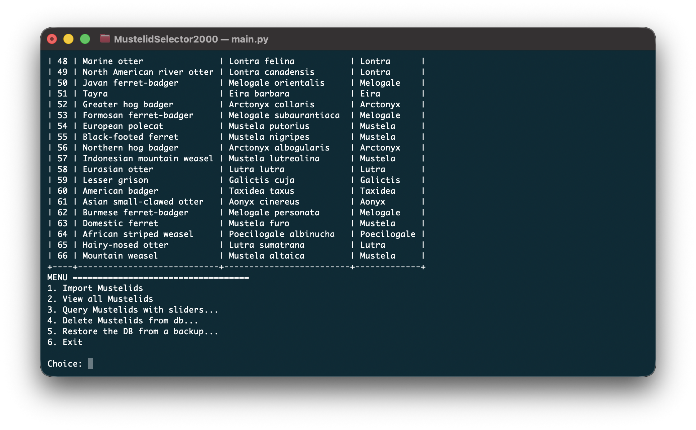

# MustelidSelector2000

A performant way of storing, retrieving, and sorting mustelids. :3

### Instalation

```pip install -r requirements.txt```

# TUI

The TUI can be run through the database manager:

```python DB/main.py```

# The GUI

The WebUX can be hosted via Tailscale by running the Python server:

``python sort.py``

Annnnnd navigating to the URL below:

``https://[TAILSCALE_IP_ADDRESS]/``

# Schema

All TUI-based interactions are dependant upon data.sql, which can be generated via: `python DB/import.py`


MustelidSelector2000 uses a 3NF Schema.

**Traits Table** (id and name)
**MustelidsTraits Table** (id, name,value)
**Mustelids Table** (id, name,description,fun_fact,weight,lifespan,wiki_url,image_url,habitat)
**MustelidHabitats** (id, habitat_id)
**Habitats Table** (id, name)

### About the TUI



The TUI is capable of importing mustelids from the primary mustelids file (DB/data.sql), listing all Mustelids in the database, searching and filtering mustelids based on attribute sliders, and deleting mustelids at index.

### About the GUI

The GUI doesn't use the SQL backend *at all*. Rather, it uses cached JSON of each mustelid to retrieve closest matches, and caches assets of each mustelid in the background. If, for whatever reason, an image could not be pre-cached, the GUI attempts to download each image JIT style.

### Reflection

A mustelid selector is a cute idea for a database project, and I hope my friend liked it! I loved using Creama to build the GUI, and it was fun to dip my toes into TUI design, too!

Going forward, I want to do a better job with data handling. The organization and caching is *fine*, but I could do better by removing redundancy and following DRY principles more closely.
