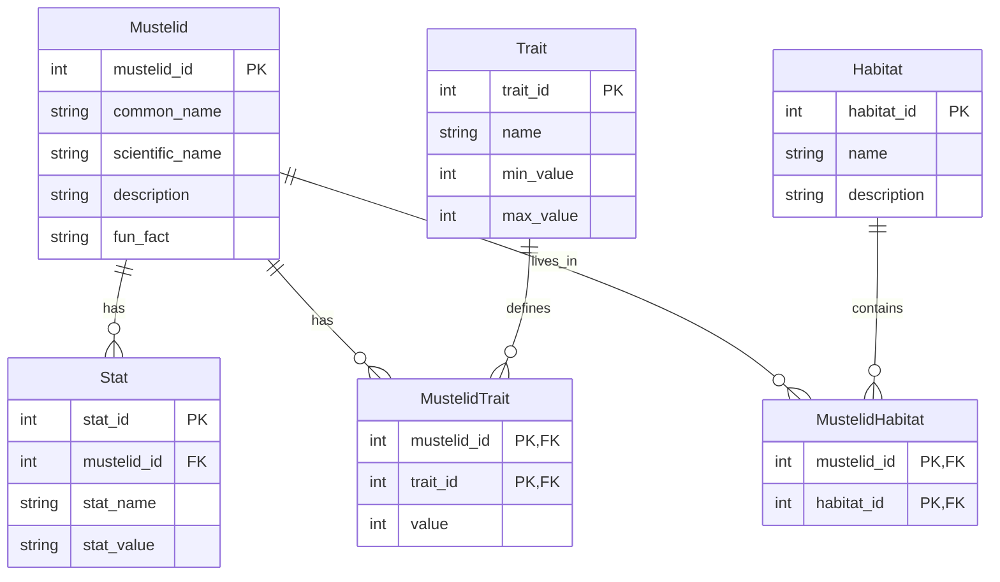

```mermaid
erDiagram

Mustelid {
  int mustelid_id PK
  string common_name
  string scientific_name
  string description
  string fun_fact
}

Trait {
  int trait_id PK
  string name
  int min_value
  int max_value
}

MustelidTrait {
  int mustelid_id PK, FK
  int trait_id PK, FK
  int value
}

Habitat {
  int habitat_id PK
  string name
  string description
}

MustelidHabitat {
  int mustelid_id PK, FK
  int habitat_id PK, FK
}

Stat {
  int stat_id PK
  int mustelid_id FK
  string stat_name
  string stat_value
}

Mustelid ||--o{ Stat : has
Mustelid ||--o{ MustelidTrait : has
Trait ||--o{ MustelidTrait : defines
Mustelid ||--o{ MustelidHabitat : lives_in
Habitat ||--o{ MustelidHabitat : contains
```